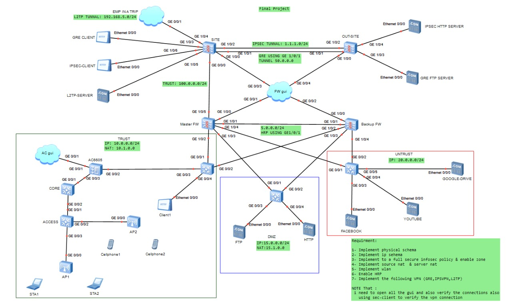

# 🛡️ Huawei Enterprise Network Security Lab
### HCIA Security Final Project

<p align="center">


</p>

---

# 📖 Overview

This project demonstrates the implementation of a secure enterprise network using **Huawei eNSP**.

The lab simulates a real-world enterprise environment with:

- 🔥 Dual Huawei Firewalls (HRP High Availability)
- 🌍 Multi-site Network
- 🔒 Zone-Based Security Policy
- 🌐 GRE Tunnel
- 🔐 IPSec VPN
- 🔑 L2TP VPN
- 🖥️ DMZ Servers
- 🌐 NAT Configuration
- 📶 WLAN Integration
- 🛡️ Enterprise Security Best Practices

---

# 🖼️ Network Topology


```markdown

```

---

# 🚀 Features

| Feature | Status |
|---------|--------|
| Enterprise Routing | ✅ |
| Dual Firewall HA | ✅ |
| HRP | ✅ |
| NAT | ✅ |
| GRE VPN | ✅ |
| IPSec VPN | ✅ |
| L2TP VPN | ✅ |
| DMZ | ✅ |
| Zone Security | ✅ |
| Wireless Network | ✅ |

---

# 📁 Project Structure

```
Huawei-Network-Security-Final-Project
│
├── README.md
├── Topology
│   └── Network-Topology.jpg
│
├── Project
│   ├── Project.topo
│   ├── Configurations
│   └── Screenshots
```

---

# 🖥️ Technologies Used

- Huawei eNSP
- Huawei USG Firewalls
- Huawei AR Routers
- Huawei Switches
- Huawei AC + AP
- HRP
- NAT
- GRE
- IPSec
- L2TP
- OSPF
- Static Routing

---

# 📌 Project Objectives

- Build a secure enterprise network.
- Configure firewall redundancy using HRP.
- Deploy GRE/IPSec/L2TP VPNs.
- Configure NAT policies.
- Secure traffic using zone-based firewall policies.
- Publish DMZ services.
- Verify end-to-end connectivity.

---

# 📷 Screenshots

> Screenshots will be added soon.

---

# 👨‍💻 Author

**Youssef Khaled Rizk**

Computer Science Graduate  
HCIA Security Certified  
AWS & Network Security Enthusiast

---

⭐ If you like this project, don't forget to star the repository.
